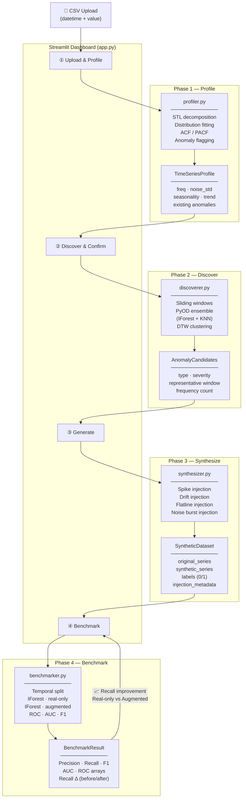

# 🔥 AnomalyForge

> Prove that synthetic anomaly augmentation improves rare-event detection — end to end, in a live Streamlit demo.

AnomalyForge is a 4-phase time-series anomaly detection and synthesis pipeline. It takes real-world time-series data (e.g. server CPU utilization), discovers anomaly patterns, synthesizes labeled training data, and benchmarks IsolationForest **before vs. after** augmentation — showing measurable recall improvement on a held-out test set.

---

## System Diagram



---

## Pipeline Phases

| Phase | Module | Input | Output |
|-------|--------|-------|--------|
| 1 · Profile | `profiler.py` | Raw `pd.Series` | `TimeSeriesProfile` |
| 2 · Discover | `discoverer.py` | Series + Profile | `list[AnomalyCandidate]` |
| 3 · Synthesize | `synthesizer.py` | Series + Candidates + Config | `SyntheticDataset` |
| 4 · Benchmark | `benchmarker.py` | SyntheticDataset + Config | `BenchmarkResult` |

---

## Anomaly Types Synthesized

| Type | Description | CPU Example |
|------|-------------|-------------|
| **Spike** | Single-point extreme deviation (±3σ) | Cron job firing, GC pause |
| **Drift** | Linear ramp over N samples | Memory leak, queue backup |
| **Flatline** | Segment held at constant value | Stuck sensor, frozen metric feed |
| **Noise Burst** | High-variance Gaussian segment | Retry storm, thundering herd |

---

## Quickstart

```bash
# Clone and set up
git clone https://github.com/quietspoon/anomaly-forge.git
cd anomaly-forge
python3 -m venv .venv && source .venv/bin/activate
pip install pandas numpy scipy statsmodels pyod scikit-learn \
            dtaidistance streamlit matplotlib seaborn pytest

# Run the app
streamlit run app.py
```

Open **http://localhost:8501** — upload any two-column datetime CSV and follow the 4-step flow.

### Run tests (Docker)

```bash
docker-compose run --rm test pytest tests/ -v --tb=short
```

---

## Tech Stack

| Layer | Libraries |
|-------|-----------|
| Data | `pandas` · `numpy` |
| Statistics | `scipy` · `statsmodels` (STL) |
| Anomaly detection | `pyod` (IForest + KNN) · `scikit-learn` (IsolationForest) |
| Clustering | `dtaidistance` (DTW) · `sklearn.AgglomerativeClustering` |
| Visualization | `matplotlib` · `seaborn` |
| Dashboard | `streamlit` |
| Testing | `pytest` · Docker |

---

## Project Structure

```
anomaly-forge/
├── src/
│   ├── types.py          # Shared dataclasses (data contracts)
│   ├── utils.py          # sliding_window, normalize, temporal_split, plot helpers
│   ├── profiler.py       # Phase 1 — STL, distribution fitting, ACF/PACF
│   ├── discoverer.py     # Phase 2 — PyOD ensemble + DTW clustering
│   ├── synthesizer.py    # Phase 3 — 4 anomaly injection types
│   └── benchmarker.py    # Phase 4 — IForest real-only vs augmented
├── tests/                # 89 pytest tests, all run in Docker
├── app.py                # Streamlit 4-screen dashboard
├── Dockerfile
└── docker-compose.yml
```
